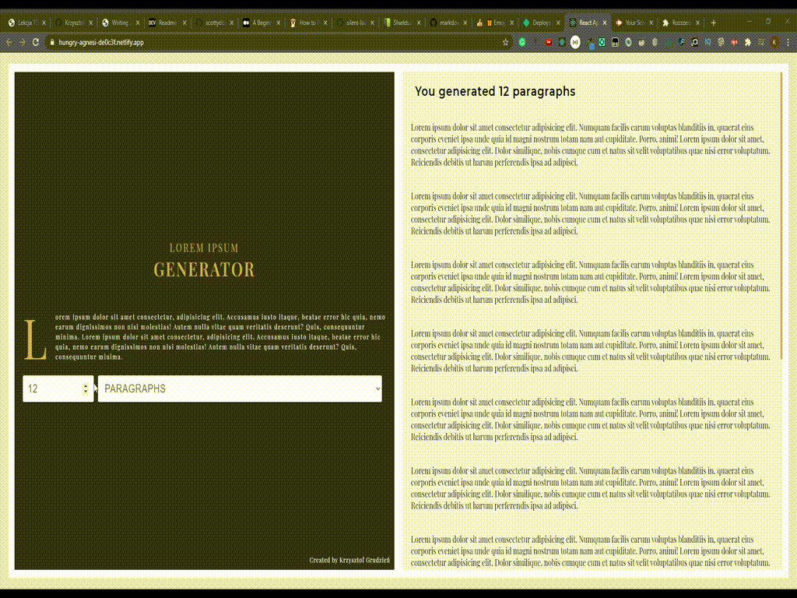

# Lorem Ipsum Generator

## About project

This project was bootstrapped with [Create React App](https://github.com/facebook/create-react-app). The app was created to improve and develop JS and React skills. Application is very easy to use and gives us a similar solution like in many other applications of that type. The app tries to be as dynamic as possible. If you only choose something the view is automatically updated and you get what you expect. For paragraphs and sentences, you can generate a max of 20 items, so if you write more than 20 the program setup automatically values equal to 20.

## Video preview

## [Demo version](https://hungry-agnesi-de0c3f.netlify.app/)

[SEE PROJECT HERE](https://hungry-agnesi-de0c3f.netlify.app/)

## Technology, methodology and tools

I've used here:

- React.js
- React Hooks
- Sass
- Custom Properties
- BEM
- Adobe XD
- VSC
- Netlify

## How to run the app in local environment

### Instalation

- Clone repo to your computer
- Add path of the project to the terminal
- Write command `npm install`

### `npm start` - Runs the app in the development mode.

Open [http://localhost:3000](http://localhost:3000) to view it in your browser.

The page will reload if you make edits.
You will also see any lint errors in the console.

## Contact to me

If you want to contact me you can write me at krzysztof.grudzien.fed@gmail.com.

## License

This project don't have a license
